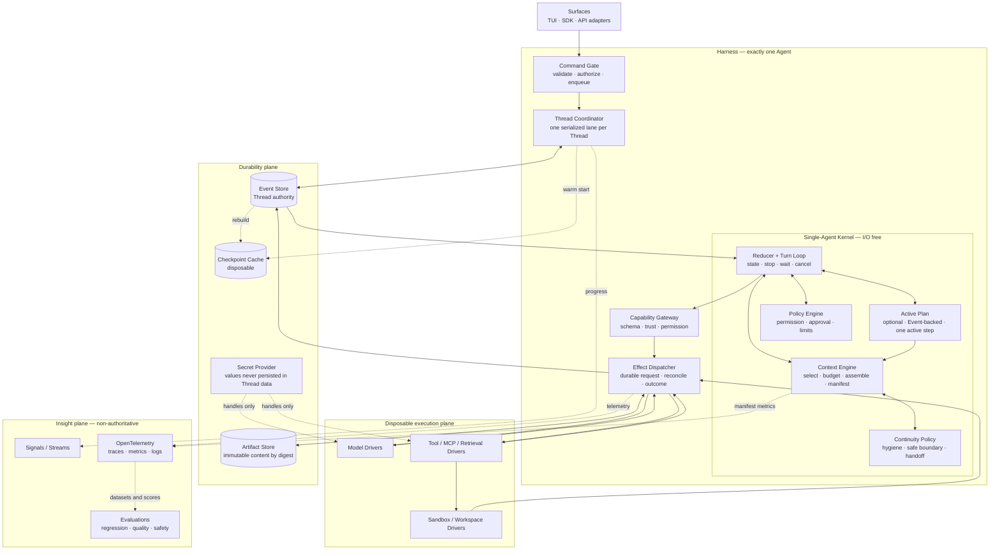
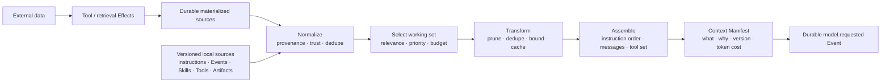
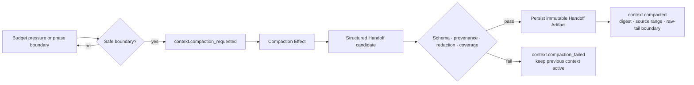
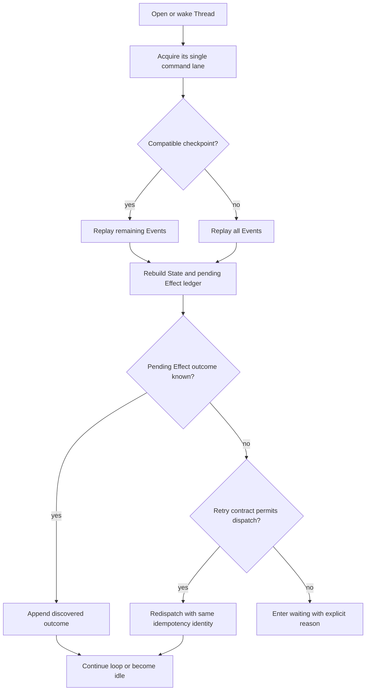

# Jixu Architecture

| Field | Value |
| --- | --- |
| Status | Accepted north star |
| Scope | Portable, durable, single-Agent Harness |
| Updated | 2026-08-19 |
| Companion | [`SPEC.md`](./SPEC.md) |

This document defines the accepted stable shape of Jixu. It is architectural,
not directly normative: `SPEC.md` remains the authority for implemented public
semantics. Any mismatch MUST be resolved by updating `SPEC.md` before
implementation.

The goal is not to predict every future feature. The goal is to fix the few
boundaries that future features must fit inside, so Jixu can grow without adding
another execution model, another source of truth, or another public noun.

## 1. Product thesis

Jixu is a **portable, durable, context-native operating layer for one Agent**.

The operating-system analogy is deliberate but limited:

- the Kernel owns deterministic transitions;
- the Context Engine manages the model's scarce working set;
- Tools and sandboxes form a capability-controlled syscall boundary;
- the Event log provides durable process history;
- a Thread provides durable identity and one serialized command lane; and
- Signals, traces, and evaluations make behavior inspectable.

Jixu is not a general-purpose operating system, a workflow engine, or a
multi-Agent orchestrator. Its public promise stays small:

> Define one Agent. Give it capabilities. Continue its work in a durable Thread.

The desired quality is **small outside, deep inside**: a minimal developer API
backed by strong context engineering, recovery, security, and observability.

## 2. Decisions intended to remain stable

1. **One Agent.** A Harness owns exactly one immutable Agent definition. There
   is no routing, handoff, supervisor, swarm, graph, or Agent-as-Tool primitive.
2. **One authority.** The ordered Event log is the sole authority for Thread
   lifecycle and State.
3. **One execution path.** Observable work follows
   `Event -> Reducer -> Effect -> Driver -> Event`.
4. **One writer per Thread.** Commands for one Thread are serialized. Readers
   and observers may be concurrent.
5. **Context is compiled, not accumulated.** Raw history remains durable;
   model-visible context is a bounded, explainable projection.
6. **Compute is disposable.** A process, worker, sandbox, or Durable Object may
   disappear and be reconstructed from durable facts.
7. **Capabilities are explicit.** Every external action crosses typed policy,
   permission, and Driver boundaries.
8. **Observation is not authority.** Traces, metrics, streamed tokens, UI state,
   and provider state cannot decide canonical Thread status.
9. **Progressive disclosure everywhere.** Skills, Tools, knowledge, and advanced
   APIs are loaded or exposed only when relevant.
10. **No hidden guarantees.** Unknown non-idempotent outcomes remain unknown;
    Jixu never renames at-least-once behavior as exactly-once.
11. **Planning coordinates; it does not execute.** An autonomous Plan may guide
    difficult work inside one Thread, but never becomes a workflow, permission
    source, Effect scheduler, or second execution identity.
12. **Compaction hands work forward.** Automatic compaction produces a
    source-linked Continuity Handoff at a safe boundary; it never deletes the
    Event history or reduces continuity to an opaque provider summary.

These are architecture invariants, not implementation preferences.

## 3. Concept model

### 3.1 Public concepts

Normal developers should need four nouns:

| Concept | Meaning |
| --- | --- |
| **Harness** | The configured operating layer for exactly one Agent. It binds Stores, Drivers, policy, context, and observation ports but is not durable authority. |
| **Agent** | Immutable behavior: instructions, model profile, capability descriptors, Skill catalogue, context policy, and limits. |
| **Thread** | One durable, addressable stream of work for that Agent, with ordered input, actions, replies, lineage, and recovery. |
| **Tool** | A typed capability through which the Agent can observe or change the outside world. |

`Skill`, `Artifact`, `Plan`, `Continuity Handoff`, `Context Manifest`,
`Checkpoint`, and `Signal` are useful data or extension types. They do not need
independent user-facing lifecycles.

The following are deliberately not Jixu product concepts:

- `Session` and `Conversation` duplicate Thread;
- `Run`, `Job`, and `Task` imply a second execution identity;
- `Workflow` and `Graph` imply a second control model; and
- `Memory` is too overloaded to be a single authority or manager.

A **turn** is only a causal span from one accepted input to a stable boundary.
It can have correlation metadata but no separate store or state machine.

### 3.2 Internal concepts

The reliability model uses a small set of precise implementation terms:

| Term | Responsibility |
| --- | --- |
| **Event** | Immutable, ordered, schema-versioned fact accepted by a Thread. |
| **State** | Deterministic projection of committed Events. |
| **Reducer** | Pure transition from State and Event to new State and proposed Effects. |
| **Effect** | Typed request for work outside the pure Kernel. |
| **Driver** | Adapter that performs an accepted Effect and returns a typed outcome. |
| **Policy** | Deterministic rules for permissions, approvals, budgets, retry, and stopping. |
| **Plan** | Optional Event-backed coordination data for one active objective; it cannot dispatch work. |
| **Continuity Handoff** | Immutable, validated context segment that carries essential work state across compaction boundaries. |
| **Signal** | Transient progress observation that never changes State. |
| **Checkpoint** | Disposable acceleration cache derived from Events. |

These internals remain behind the normal Harness and Thread API.

## 4. Stable total architecture



The diagram has six durable boundaries, not six public frameworks:

1. thin surfaces;
2. command serialization;
3. one pure single-Agent Kernel;
4. disposable external execution;
5. authoritative durable facts; and
6. non-authoritative insight.

New capabilities should enter through an existing port. A feature that requires
another state machine, another canonical history, or another Agent is a design
conflict, not an extension.

## 5. The Single-Agent Kernel

The Kernel answers only deterministic questions:

- Is this command legal in the current State?
- What State follows from this committed Event?
- What context should the next model call receive?
- Which Effects are now proposed?
- Does policy allow, deny, pause, or request approval?
- Should the turn continue, wait, stop, or consume queued input?

The Kernel does not call SDKs, Stores, clocks, random generators, filesystems,
tokenizers with hidden mutable state, or network services. All changing inputs
are injected or first materialized as durable facts.

The model loop remains conventional and legible:

```text
accepted input
  -> compile context
  -> model Effect
  -> model output
  -> zero or more Tool Effects
  -> Tool outcomes
  -> compile the next context
  -> final reply or an explicit stop boundary
```

Maximum steps, token/cost budgets, time budgets, cancellation, pause, approval,
and waiting are Policy decisions around this same loop. They do not create a
workflow engine.

### 5.1 Autonomous execution Plan

Jixu supports an **autonomous execution Plan** for work whose quality benefits
from explicit intermediate intent. This is not a user-selected Plan Mode:

- **Plan Mode** is an optional surface policy that may prohibit execution while
  a user and Agent discuss an approach;
- an **execution Plan** is temporary coordination data used while the ordinary
  Agent loop continues to act under the same permissions and Effect protocol.

The Agent should create a Plan when work has dependent stages, material
uncertainty, a long recovery horizon, or explicit verification and rollback
boundaries. It should act directly for a short answer, one known operation, or
another task where the Plan would merely restate the request. The decision is
adaptive; a fixed ritual on every turn would waste context and make simple work
worse.

A Plan is a compact, revisioned snapshot containing:

- one objective and its acceptance criteria;
- a short ordered list of outcome-oriented steps;
- step status (`pending`, `in_progress`, `completed`, `blocked`, or `skipped`)
  and evidence references;
- assumptions, blockers, and the next safe action; and
- `active`, `completed`, `superseded`, or `abandoned` status.

One Thread may retain multiple historical Plans, but has at most one active Plan
and one active step. New evidence revises the current Plan; a materially changed
objective supersedes it. Completed and superseded Plans stay in Events for audit
and recovery but leave the default working context. A revision whose steps are
all completed or skipped becomes completed directly; completion is derived
rather than requiring a second ceremonial model operation.

The model proposes Plan changes as typed control output derived from current
State: `create` is exposed only without an active Plan, while an active Plan may
be revised, superseded, or abandoned. The Kernel validates shape and scope. A
valid change is committed as `plan.updated` before the new projection is exposed
or Effects from the same model output are dispatched. An invalid change is
committed as `plan.rejected`; it preserves the last valid Plan and cannot turn
otherwise valid response content or Tool calls into a model failure. Plan
changes do not call a Tool, authorize an Effect, reserve compute, or widen user
scope. The same Reducer, Policy, and Effect protocol remain the only way to act.

This placement gives each concern one owner:

| Concern | Owner |
| --- | --- |
| Decide whether planning is useful and propose revisions | The one Agent through an ordinary Model Effect |
| Validate lifecycle invariants and derive the active Plan | Kernel and Reducer |
| Persist accepted and rejected Plan proposals | Thread Events |
| Select the active Plan into model-visible context | Context Engine |
| Render progress or allow inspection | Surface projection |

### 5.2 Input while work is active

A Thread is an inbox as well as a history:

- input sent while `idle` starts work immediately;
- input sent while `running` is durably queued and starts automatically after
  the current turn reaches a safe boundary;
- explicit steering or cancellation may interrupt only at declared safe
  boundaries; and
- queued input never creates a hidden replacement Thread.

This preserves the ordinary expectation that sending a message causes a reply,
without allowing two writers to race one Thread State.

## 6. Context Engine

Context engineering is a first-class subsystem because model quality depends
less on the amount of available data than on the relevance, ordering, trust,
and clarity of the model's current working set.

### 6.1 Source model

The Context Engine can draw from:

1. immutable Agent instructions and Policy constraints;
2. current input and explicit success criteria;
3. Thread Events after the active clear boundary;
4. Tool schemas and progressively disclosed capability metadata;
5. Skill catalogue entries and activated Skill content;
6. the active Plan and accepted Continuity Handoff;
7. structured working notes;
8. immutable Artifacts and workspace snapshots; and
9. retrieved external knowledge already materialized through an Effect.

Every candidate segment carries provenance, version or digest, trust level,
sensitivity, freshness, priority, estimated cost, and causal source.

### 6.2 Compilation pipeline



The compiler is deterministic for the same:

- Agent revision;
- Thread State and source revisions;
- model capability profile;
- Context Policy and budget; and
- compiler version.

The assembled request has one deliberate cache boundary:

```text
stable prefix
  immutable Agent instructions
  ordinary Tool descriptors
  state-valid built-in control descriptors

dynamic suffix
  accepted Thread history, Tool results, and latest user input
  current active Plan as the final runtime context segment
```

The reference Agent instructions are a versioned, immutable constitution for
the executable Harness: identity and mission, current Tools, adaptive Plan and
public-progress policy, evidence and validation expectations, authority and
secret constraints, efficiency, and final-response behavior. They do not claim
planned Skills, Handoff compaction, approvals, or sandbox capabilities. Runtime
facts never enter this text. In particular, an active Plan is rendered as a
late context segment rather than appended to `instructions`, so Plan revisions
extend the changing tail without rewriting the reusable prefix.

Ordinary Tool descriptors and their ordering remain stable for an Agent
snapshot. The Plan control remains derived from State because exposing invalid
operations would weaken the model contract; its schema therefore changes only
at the meaningful no-Plan/active-Plan lifecycle boundary. A controlled cache
miss at that boundary is preferable to making an invalid operation appear
available or hiding dynamic Plan JSON inside a Tool description.

Prompt caching itself belongs to the Driver boundary. OpenAI and OpenRouter
adapters may route repeated requests with a stable Thread-derived cache key;
other providers may use implicit prefix caching or omit the hint. These keys and
provider breakpoints are correlation and cost optimizations only. They never
become a Jixu Session, Thread authority, recovery dependency, or substitute for
durable cache accounting.

If a semantic transformation requires a model or provider compaction endpoint,
it is an ordinary Effect. Its result becomes a durable, source-linked context
segment; it is never hidden inside the compiler.

### 6.3 Context Manifest

Every durable model request carries a redacted `Context Manifest` describing:

- Thread revision, active clear boundary, Agent digest, and compiler version;
- active Plan revision, accepted Handoff digest, and recent raw-tail boundary;
- included segment IDs, versions, digests, provenance, trust, and token cost;
- activated Skills and exposed Tool schema versions;
- compacted, truncated, deduplicated, or excluded segments and the reason;
- model profile, total budget, reserved output budget, and cache boundaries; and
- a digest of the assembled logical request.

It stores secret handles, never secret values. Sensitive raw content need not be
duplicated: a segment must already be reconstructible from an Event, Agent
snapshot, or immutable Artifact before it can be included.

This is Jixu's main differentiator. It makes context selection observable,
reproducible, testable, and comparable across Agent revisions. A trace can show
not merely that a model failed, but what working set it received and why.

### 6.4 Continuity management and compaction

Context maintenance has three layers with different loss budgets:

1. **Hygiene** removes or replaces low-value representation: duplicate content,
   stale capability descriptions, old discovery output, and large Tool results
   already preserved as Artifacts.
2. **Continuity Handoff** semantically carries the task across a context-window
   boundary when hygiene is no longer enough.
3. **Raw history** remains in immutable Events and Artifacts for replay, audit,
   inspection, and future re-projection.

Compaction is adaptive, not a user ritual and not a fixed message count. Before
each model request, the Context Engine estimates:

```text
assembled input
  + projected next model and Tool material
  + reserved model output
  + safety margin
  <= model context budget
```

If the inequality is at risk after hygiene, the Kernel requests compaction at
the next safe boundary. It may compact opportunistically at a completed phase
boundary when the expected saving clearly exceeds compaction cost. It never
splits a model item, Tool call/result pair, approval, or other causally complete
operation.

The durable flow reuses the one Effect protocol:



An accepted Continuity Handoff contains a machine-validated envelope plus a
compact semantic body. At minimum it carries:

- current objective, acceptance criteria, scope, constraints, and permissions;
- active Plan revision, active step, and completed-step evidence;
- current State, pending Effects, waits, approvals, and unresolved questions;
- decisions and rejected alternatives with their reasons;
- failures, attempted approaches, and explicit do-not-retry guidance;
- relevant files, Artifacts, workspace snapshots, and validation evidence;
- blockers and the exact next safe action; and
- source Event range, clear boundary, schema/compiler/model versions, and
  content digests.

Authorization-related fields reference committed Policy decisions; model-written
Handoff prose can preserve them for continuity but can never grant permission.

Future context is assembled from immutable Agent material, the latest accepted
Handoff, the active Plan, a bounded tail of recent complete raw operations, and
other currently relevant sources. The tail prevents a fresh Handoff from
destroying local conversational or Tool-call detail. Repeated compaction merges,
deduplicates, and reconciles source-linked facts; it does not summarize an
untraceable summary again.

The Handoff Artifact must exist and verify by digest before
`context.compacted` can reference it. A failed or invalid compaction appends its
failure outcome but leaves the previous context projection active. Raw Events
and Artifacts are never deleted by compaction.

Provider-native compaction items may be retained as an optimization when a
Driver supports them, but they are never the sole portable continuity record or
Thread authority. Jixu always retains its structured Handoff and records any
opaque provider item in the Context Manifest. This allows another compatible
Driver to reconstruct the logical working set without pretending provider state
is portable.

`clear` is deliberately different: clear is an explicit user operation that
advances the model-visible history boundary inside the same Thread. Compaction
is an automatic representation change that preserves the current objective and
work continuity.

### 6.5 Memory without a Memory framework

Jixu does not need one overloaded `Memory` object:

| Need | Representation |
| --- | --- |
| Durable interaction history | Thread Events |
| Current executable state | Derived State |
| Model working memory | Compiled context |
| Active work coordination | Event-backed active Plan |
| Cross-window continuity | Latest accepted Continuity Handoff plus recent raw tail |
| Long-horizon notes | Source-linked Events or immutable Artifacts |
| Workspace continuity | Snapshot references recorded by Events |
| External or cross-Thread knowledge | Retrieval Tool or Context Source adapter |

Memory is therefore a context policy over durable sources, not a fifth source
of truth.

## 7. Durable execution and recovery

### 7.1 One effect protocol

Model calls, Tools, retrieval, approvals that require external resolution,
timers, sandbox operations, and snapshots use the same effect protocol:

1. a committed Event causes the Reducer to propose an Effect;
2. the coordinator appends the typed request durably;
3. only the committed request may be dispatched;
4. the Driver returns success, failure, cancellation, or indeterminate outcome;
5. the coordinator appends that outcome as an Event; and
6. reduction continues from committed facts.

Retries preserve one logical idempotency identity. Safe idempotent work may be
retried at least once. An unknown non-idempotent outcome enters `waiting` and
requires explicit resolution.

Parallel Tool work is an execution optimization, not a second model. It is
allowed only when Policy declares the Effects independent. Results are joined
in original Tool-call order for context, regardless of completion order.

### 7.2 Recovery flow



Recovery never infers success from missing data. Checkpoints may accelerate
replay but cannot change the result. Replay never dispatches a Driver.

### 7.3 Durable waits

Long-running work may wait for:

- human approval;
- additional user input;
- a timer or scheduled wake-up;
- an external callback or Signal promoted to an Event; or
- resolution of an indeterminate Effect.

The wait condition is durable State. The process or sandbox may shut down while
waiting. Wake-up delivery is an adapter concern; accepting the wake-up and
continuing work still follows the Event protocol.

## 8. Thread actor and Durable Object

`Thread Actor` is an internal coordination pattern, not a new public entity:

- one logical actor owns the command lane for one Thread;
- the actor serializes State changes and may cache hot State;
- actor memory is disposable and rebuilt from Events;
- leases or optimistic revisions prevent two actors from committing the same
  next sequence; and
- hibernation does not alter Thread semantics.

The same port can be implemented by:

- an in-process mutex for local use;
- a partitioned worker or queue consumer;
- a database-backed lease; or
- one Cloudflare Durable Object per Thread.

Cloudflare Durable Objects are a strong deployment fit because they combine a
stable identity, single-threaded coordination, and colocated durable storage.
They are not the Jixu data model. A Durable Object adapter MUST either implement
the Event Store contract itself or delegate to one Store; it MUST NOT maintain a
second mutable truth beside the Event log.

This separation keeps Jixu portable while allowing an efficient serverless
topology:

```text
Thread ID -> one actor address -> serialized commands -> Event Store
                                      |
                                      +-> disposable model / Tool compute
```

## 9. Data and authority boundaries

| Data | Role | Authority |
| --- | --- | --- |
| Event log | Lifecycle facts, inputs, requests, outcomes, lineage, waits | Sole authority for Thread State |
| Immutable Artifact Store | Large content addressed by digest and referenced from Events | Authority for bytes only; cannot decide Thread status |
| Derived State | Fast executable projection | Rebuilt from Events |
| Effect ledger | View of requested, dispatched, and resolved Effects | Derived from Events |
| Efficiency accounting | Model/Tool calls and attempts, outcomes, reported tokens, trusted cost | Derived from terminal and request Events |
| Checkpoint | State plus replay cursor and digest | Disposable cache |
| Live workspace / sandbox | External execution target | Not Thread authority; snapshot when continuity requires it |
| Search index | Retrieval optimization | Rebuildable derivative |
| Signals and OTel telemetry | Progress and diagnosis | Non-authoritative and droppable |
| Secret Provider | Credential values | External security boundary; values never enter Thread data |

An Artifact referenced by a committed Event must already exist durably and be
verified by digest. Missing referenced content is corruption, not permission to
silently continue with different input.

## 10. Capability and security architecture

All action passes through one Capability Gateway:

```text
model Tool call
  -> schema validation
  -> trust and permission policy
  -> optional durable approval
  -> budget / timeout / idempotency policy
  -> sandbox or remote Driver
  -> output validation, size limit, and redaction
  -> durable outcome
```

The gateway supports local typed Tools and MCP adapters without making either
protocol authoritative. Tool descriptions and MCP annotations are untrusted
input, not security policy.

Security properties:

- least-privilege filesystem, network, process, and credential access;
- explicit workspace roots and sandbox strength;
- input, output, and Tool guardrails at their actual trust boundaries;
- durable allow, deny, and approval decisions without durable secret values;
- secret handles resolved only inside Drivers;
- sanitized errors and bounded Tool output;
- versioned Tool schemas and Skill sources; and
- fail-closed behavior for unknown persisted schemas or capabilities.

The Harness owns policy and bookkeeping. A sandbox owns command execution,
filesystem changes, and isolation. Separating those responsibilities makes the
sandbox replaceable and prevents its live state from becoming the control
plane.

## 11. Observability and evaluation

Jixu needs two observation levels:

### Durable inspection

Events answer what was accepted, requested, and completed. They support replay,
recovery, audit, fork, and time-travel inspection.

The same Events carry compact canonical accounting facts. Thread State projects
logical model and Tool calls separately from dispatch attempts, terminal
outcomes, provider-reported input/output/reasoning/cache tokens, and trusted USD
cost. Missing usage and unpriced outcomes remain explicit. Cost is integer
nanodollars with source metadata; core never guesses current model prices or
turns an unknown value into zero. This ledger enables efficiency review without
becoming a hosted billing product or replacing a provider invoice.

### Operational telemetry

Signals and OpenTelemetry describe what is happening now:

- model, Tool, sandbox, Store, and context-compilation spans;
- token use, cost, latency, queue time, retries, and cache behavior;
- context budget utilization and segment selection;
- approvals, policy denials, guardrail trips, and recovery paths;
- streamed tokens and Tool progress; and
- correlation by Thread, turn, Event, Effect, and causation IDs.

Surfaces may turn committed Events and transient Signals into compact high-level
status such as thinking, reading, running, or responding. This projection is
non-authoritative and must never expose or reconstruct hidden chain-of-thought.
Every model request includes one reserved `jixu_progress_update` control. A
cooperating model may use it once to describe the next observable action in the
user's language. The adapter validates the bounded phrase and emits
`model.progress` without creating another model request, Tool call, Event, or
State field; malformed or absent output is cosmetic failure and is ignored.
The surface carries a valid phrase through the following Tool action while the
durable Tool Event supplies the factual operation and target.
High-frequency output Signals may be coalesced into bounded presentation frames
as long as text order is preserved and the committed Event atomically replaces
the transient projection at the stable boundary. Public model content remains a
transcript item even when the same response requests Tools; Tool execution is
not a reason to erase already presented public text.
Decorative execution motion belongs entirely to the surface projection. It uses
the fixed-width `JIXU` wordmark and moves emphasis through existing Nippon
semantic colors. Response streaming and reduced-motion mode use the complete
static wordmark rather than freezing an animation frame. Motion never adds a
timer, phase, or lifecycle to core State. The Composer column already owns a
permanent two-row status footer beneath its compact input surface. During live
work, the first row shows the current observable phase and the second projects
Tool requests from durable Events, updating matching outcomes in place for the
turn. Repeated or overflowing operations may be compacted while the Activity
rail retains the full history. At idle the same rows show ordinary model, shell,
and cost context. Live work changes content, never footer or input geometry.

Telemetry MUST be redacted independently from durable data and may be sampled or
dropped. OpenTelemetry semantic conventions are preferred over a proprietary
trace model.

Evaluation closes the engineering loop:

```text
versioned Agent + scenario + expected invariants
  -> real Harness execution
  -> Events + Context Manifests + traces
  -> deterministic checks + task graders + optional model graders
  -> regression comparison by Agent / policy / compiler / model revision
```

Evaluation scores do not mutate Thread State unless an explicit Policy turns a
score into a durable decision. Jixu provides hooks and portable records, not an
evaluation SaaS.

## 12. Versioning and evolution

Every durable boundary is explicit about version:

- Event envelope and payload schema;
- Agent definition digest;
- Reducer and Context Compiler version;
- Plan, Continuity Handoff, and Context Manifest schema;
- Tool input and output schema;
- Skill catalogue entry and activated content digest;
- model capability profile; and
- Artifact format where interpretation matters.

A Thread remains pinned to a compatible Agent revision. Agent changes apply to
new Threads by default. Continuing old work under meaningfully changed
instructions, Tools, or Policy requires an explicit Fork or migration boundary,
never silent rebinding.

Unknown durable versions fail closed. Before the first stable release, Jixu
keeps only the current schema and recreates incompatible development Threads.
Published-version upgrades, when introduced, use explicit tested migrations
rather than reflection or a generic plugin registry.

### Architecture fitness rules

A change is architectural and requires maintainer approval if it:

- adds a public lifecycle concept;
- adds another durable authority or state machine;
- bypasses the Effect protocol;
- allows more than one Agent inside a Harness;
- makes core depend on a provider, database, cloud, UI, or MCP SDK;
- changes the one-writer-per-Thread rule; or
- makes context selection impossible to explain from a Context Manifest.

Everything else should fit behind typed ports. Dependency tests, replay tests,
Store and Driver contracts, Context Manifest golden invariants, and the public
acceptance path should enforce these boundaries mechanically.

## 13. Extension ports

The stable architecture needs narrow typed ports, not a universal plugin system:

| Port | Purpose |
| --- | --- |
| `EventStore` | Atomic creation, optimistic append, ordered read, fork, list |
| `CheckpointStore` | Optional disposable recovery acceleration |
| `ArtifactStore` | Immutable content-addressed large data |
| `ModelDriver` | Provider-neutral model Effect execution |
| `ToolDriver` | Typed local, remote, or MCP Tool execution |
| `SandboxDriver` | Isolated workspace and command execution |
| `ContextSource` | Versioned candidate context; I/O materialization still uses Effects |
| `Policy` | Pure permission, budget, retry, approval, and stop decisions |
| `SecretProvider` | Resolve opaque credential handles inside Driver boundaries |
| `SignalSink` / `TelemetrySink` | Streaming progress and OTel export |
| `ThreadCoordinator` | Local, leased, queued, or Durable Object serialization |

An abstraction should be promoted to a port only after at least two concrete
adapters need the same contract.

## 14. Explicit non-goals

Jixu will not become:

- a multi-Agent framework;
- a graph, workflow, or DAG authoring system;
- a mandatory planning ritual or user-facing Plan Mode in core;
- a hosted control plane, queue, vector database, observability backend, or
  evaluation service;
- a replacement for MCP, Agent Skills, OpenTelemetry, provider SDKs, or sandbox
  vendors;
- an autonomous cross-Thread memory product;
- a provider-conversation wrapper;
- an opaque provider compaction record as portable continuity authority;
- a guarantee of exactly-once external action without downstream idempotency;
- a cloud-specific Durable Object framework; or
- a generic registry/decorator/reflection system hiding control flow.

Applications can implement domain workflows with Tools and Agent instructions.
That does not add a second orchestration primitive to Jixu.

## 15. Relationship to the normative SPEC

`SPEC.md` v0.4 establishes the essential spine:

- exactly one Agent per Harness;
- Thread as the durable multi-turn identity;
- Event log as sole State authority;
- pure Reducer and explicit Effect/Driver boundary;
- replay without Effects, explicit Fork lineage, and disposable Checkpoints;
- replaceable Stores and model/Tool Drivers; and
- no provider-owned conversation authority or multi-Agent runtime.

The accepted refinements are now release-blocking requirements:

| Area | Normative coverage |
| --- | --- |
| Autonomous Plan | `JX-PLAN-001` through `JX-PLAN-009`; `JX-AC-021`, `JX-AC-022`, and `JX-AC-031` |
| Context compilation and manifest | `JX-CTX-001` through `JX-CTX-004`; `JX-AC-027` |
| Cache-stable request assembly | `JX-CTX-014`, `JX-CTX-015`, `JX-AGENT-001`, `JX-AGENT-002`, and `JX-AC-035` |
| Continuity Handoff and compaction | `JX-CTX-005` through `JX-CTX-013`; `JX-AC-023` through `JX-AC-026` |
| Active input | `JX-THREAD-002`, `JX-THREAD-003`, and `JX-THREAD-013`; `JX-AC-020` |
| Live TUI continuity | `JX-TUI-019`, `JX-TUI-021`, and `JX-AC-036` |
| Progressive Skills | `JX-SKILL-001` through `JX-SKILL-003` |
| Artifact integrity | `JX-STORE-008` and `JX-AC-025` |

Policy/HITL, richer sandbox/workspace semantics, portable OTel evaluation,
deployment coordination, and complete version migration remain later milestones.
They must fit the boundaries in this architecture before receiving their own
stable acceptance requirements.

## 16. Delivery sequence

Architecture stability does not require implementing everything at once. The
dependency-respecting sequence is:

1. **Semantic reset:** reconcile `SPEC.md`, `AGENTS.md`, public names, and the
   interrupted implementation with this accepted architecture.
2. **Durable Thread spine:** one Agent, one writer, queued input, Event/Effect
   protocol, replay, fork, clear, and crash recovery.
3. **Context foundation:** versioned sources, optional active Plan, compiler,
   budgets, adaptive Handoff compaction, progressive Skill/Tool disclosure, and
   Context Manifest.
4. **Capability boundary:** policy, approvals, guardrails, secret handles,
   sandbox/workspace, Artifacts, and MCP adapters.
5. **Insight loop:** Signals, OTel export, context inspection, evaluation hooks,
   and regression acceptance.
6. **Deployment adapters:** local coordinator first, then worker/lease and
   optional Cloudflare Durable Object implementations.
7. **Reference surfaces:** keep the TUI thin and make every interaction exercise
   the same public Harness/Thread path.

Each stage must leave the architecture easier to explain, include only the
minimum load-bearing tests, and stop for maintainer acceptance before commit or
publication.

## 17. Research basis

This architecture synthesizes primary sources rather than copying one framework:

- [OpenAI — Harness engineering](https://openai.com/index/harness-engineering/):
  repository knowledge, progressive disclosure, explicit architecture rules,
  and mechanical boundary enforcement.
- [OpenAI — The next evolution of the Agents SDK](https://openai.com/index/the-next-evolution-of-the-agents-sdk/):
  configurable memory, sandbox-aware orchestration, workspace manifests, and
  separation of harness state from disposable compute.
- [OpenAI Agents SDK — Context management](https://openai.github.io/openai-agents-js/guides/context/),
  [Tools](https://openai.github.io/openai-agents-js/guides/tools/), and
  [Sandbox Agents](https://openai.github.io/openai-agents-js/guides/sandbox-agents/concepts/):
  LLM-visible versus local context, deferred Tool disclosure, capability
  boundaries, workspace lifecycle, approvals, and resume bookkeeping.
- [Anthropic — Effective context engineering for AI agents](https://www.anthropic.com/engineering/effective-context-engineering-for-ai-agents):
  context as a finite attention budget, just-in-time retrieval, compaction,
  structured notes, and removal of low-signal Tool output.
- [Anthropic — Effective harnesses for long-running agents](https://www.anthropic.com/engineering/effective-harnesses-for-long-running-agents):
  durable progress artifacts, clean checkpoints, incremental work, and
  self-verification across context windows.
- [OpenAI Codex — default planning instructions](https://github.com/openai/codex/blob/main/codex-rs/core/gpt_5_1_prompt.md)
  and [Plan Mode template](https://github.com/openai/codex/blob/main/codex-rs/collaboration-mode-templates/templates/plan.md):
  autonomous lightweight plans for non-trivial execution, kept distinct from a
  user-selected read-only planning surface.
- [OpenAI Codex — compact prompt](https://github.com/openai/codex/blob/main/codex-rs/prompts/templates/compact/prompt.md)
  and [Responses API compaction](https://openai.com/index/equip-responses-api-computer-environment/):
  continuity-focused handoff, automatic compaction, opaque provider items, and
  preservation of information required to continue work.
- [Anthropic — Context compaction](https://platform.claude.com/docs/en/build-with-claude/compaction):
  server-side context-window management, triggers, summaries, and retained
  recent context.
- [ReAct](https://arxiv.org/abs/2210.03629),
  [Plan-and-Solve](https://arxiv.org/abs/2305.04091), and
  [NATURAL PLAN](https://arxiv.org/abs/2406.04520): planning is most useful when
  interleaved with evidence and revised during execution, not imposed as a
  rigid up-front graph for every task.
- [Pi agent-core](https://github.com/earendil-works/pi/blob/main/packages/agent/README.md)
  and [Pi coding-agent](https://github.com/earendil-works/pi/blob/main/packages/coding-agent/README.md):
  a small stateful model/Tool loop, event streaming, context transforms,
  steering queues, JSONL session trees, compaction, fork, and resume.
- [Mastra — Agent framework](https://mastra.ai/ai-agent-framework) and
  [Agent observability](https://mastra.ai/ai-agent-observability): the useful
  production surface—typed Tools, MCP, approval, workspaces, tracing, OTel, and
  scorers—while Jixu deliberately rejects its extra workflow, memory, and
  multi-Agent product concepts.
- [Temporal — Workflow execution](https://docs.temporal.io/workflow-execution)
  and [Activities](https://docs.temporal.io/activities): durable Event History,
  deterministic replay, disposable worker cache, idempotency, retry, and
  heartbeat recovery.
- [Cloudflare — Durable Objects design rules](https://developers.cloudflare.com/durable-objects/best-practices/rules-of-durable-objects/)
  and [Agents state](https://developers.cloudflare.com/agents/runtime/lifecycle/state/):
  one coordination atom per entity, single-threaded execution, colocated state,
  hibernation, and explicit persistence boundaries.
- [LangGraph — Persistence](https://docs.langchain.com/oss/javascript/langgraph/persistence):
  checkpoints for human-in-the-loop, memory, time travel, and fault tolerance,
  without adopting its graph as Jixu's public model.
- [OpenTelemetry GenAI semantic conventions](https://opentelemetry.io/docs/specs/semconv/registry/attributes/gen-ai/):
  portable Agent, model, Tool, token, cache, and correlation telemetry.
- [Model Context Protocol — Tools](https://modelcontextprotocol.io/specification/draft/server/tools)
  and [Authorization](https://modelcontextprotocol.io/specification/2025-06-18/basic/authorization):
  interoperable Tool schemas, human denial, least privilege, and OAuth audience
  binding.
- [Agent Skills specification](https://agentskills.io/specification): versioned
  instructional packages and progressive disclosure.

The synthesis is intentionally selective: Jixu adopts the strongest invariants
from durable workflow systems, the context discipline of modern coding Agents,
and ecosystem protocols at adapter boundaries, while rejecting multi-Agent and
workflow complexity from its public model.
