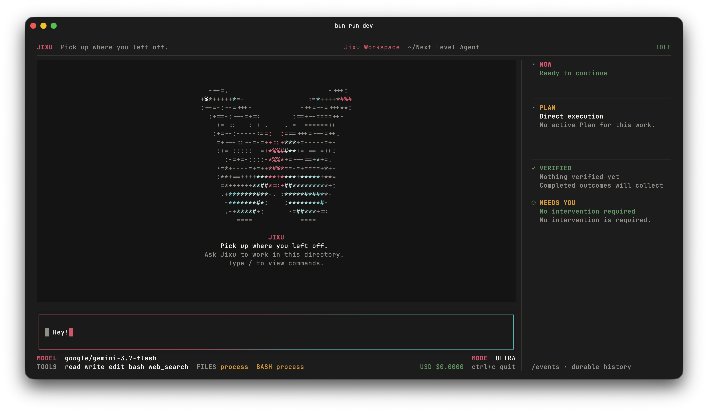

# Jixu

Jixu is a durable single-Agent Harness for TypeScript. Define one Agent, give
it Tools, and continue its work in a durable Thread.

> Jixu is pre-1.0. The public API may change before 1.0.



## Install

Install the TUI globally with npm, pnpm, or Bun:

```bash
npm install -g jixu-ai
# pnpm add -g jixu-ai
# bun add -g jixu-ai
```

Then `jixu` will start the TUI from any terminal:

```bash
jixu
```

Ephemeral execution is also supported:

```bash
npx jixu-ai
# pnpm dlx jixu-ai
# yarn dlx jixu-ai
# bunx jixu-ai
```

The initial native TUI targets are macOS arm64, macOS x64, and Linux x64
with glibc. Bun is not required at runtime.

Install the Agent Framework packages separately when building an application:

```bash
npm install jixu-core jixu-llm jixu-store-sqlite
```

## Quick start

```ts
import { createHarness, defineAgent } from "jixu-core";
import { createLLMModelDriver } from "jixu-llm";
import { SqliteEventStore } from "jixu-store-sqlite";

const agent = defineAgent({
  instructions: "Be precise and verify your work.",
  model: { provider: "model", model: "your-model" },
  tools: [],
});

const harness = createHarness({
  agent,
  modelDrivers: {
    model: createLLMModelDriver({
      api: "openai-chat-completions",
      apiKey: process.env.MODEL_API_KEY,
      baseURL: "https://api.example.com/v1",
    }),
  },
  store: new SqliteEventStore("./jixu.db"),
});

const thread = await harness.createThread();
const state = await thread.send("Review this design and identify its main risk.");

console.log(state.result);
```

Each Thread starts in `standard` mode, which uses the configured model's default
reasoning behavior. Switch an idle Thread to `ultra` to request the strongest
compatible reasoning effort for later model calls:

```ts
await thread.setMode("ultra");
await thread.send("Work through the edge cases and verify the result.");
```

The reference TUI exposes the same durable setting through `/mode standard` and
`/mode ultra`. Ultra prefers `xhigh`; recognized direct models that do not support
it use `high`, while OpenRouter receives `xhigh` and may map it to the closest
effort supported by the selected model. Jixu does not change the prompt, model,
provider, or protocol to provide this compatibility.

For a model that accepts image input, the TUI can paste local clipboard images
into the Composer as editable placeholders such as `[pasted image 1]`. Before
submission, the reference Composer validates and orientation-corrects each
source, downsamples it when needed, and retains only a lossless PNG of at most
4 MiB, 4,194,304 pixels, and 4,096 pixels on either edge. The Framework API
preserves the same ordered text-and-image input and continues to accept bounded
PNG, JPEG, GIF, and WebP directly:

```ts
await thread.send({
  content: [
    { type: "text", text: "What is shown in " },
    { type: "image", data: pngBytes, mediaType: "image/png" },
    { type: "text", text: "?" },
  ],
});
```

Jixu validates and stores image bytes as immutable Artifacts; durable Events
contain only references and placeholders. The selected provider model remains
responsible for supporting image input.

The ordered Event log is the source of truth. State is derived from Events, and
external work follows one path:

```text
Event -> Reducer -> Effect -> Driver -> Event
```

See [SPEC.md](./SPEC.md) for the full product contract and
[CONTRIBUTING.md](./CONTRIBUTING.md) for development guidance.

## Core status

- [x] **Durable Threads** — multi-turn Agent work survives process restarts,
  with pause, continue, clear, fork, recovery, and side-effect-free replay.
- [x] **Reliable execution** — every model and Tool action is durably requested
  before dispatch, with typed outcomes, bounded retries, approvals, and
  indeterminate-failure handling.
- [x] **A usable Agent runtime** — adaptive Plans, token and cost accounting,
  OpenAI-compatible Chat Completions, Anthropic Messages, local file and shell
  Tools, Jina Web Search, and ordered Tool permissions.
- [x] **The reference TUI and CLI path** — credential-free startup, local BYOK
  configuration, durable Thread inspection, and standalone macOS arm64,
  macOS x64, and Linux x64 release candidates verified through npm, pnpm,
  Yarn, and Bun consumers.
- [ ] **Long-context continuity** — add adaptive compaction and immutable,
  source-linked continuity snapshots for the same Agent.
- [ ] **First-class Skills and MCP Tools** — extend the same Agent through the
  existing Tool, Effect, and durable Thread model, without Agent routing or
  orchestration.

## License

MIT
