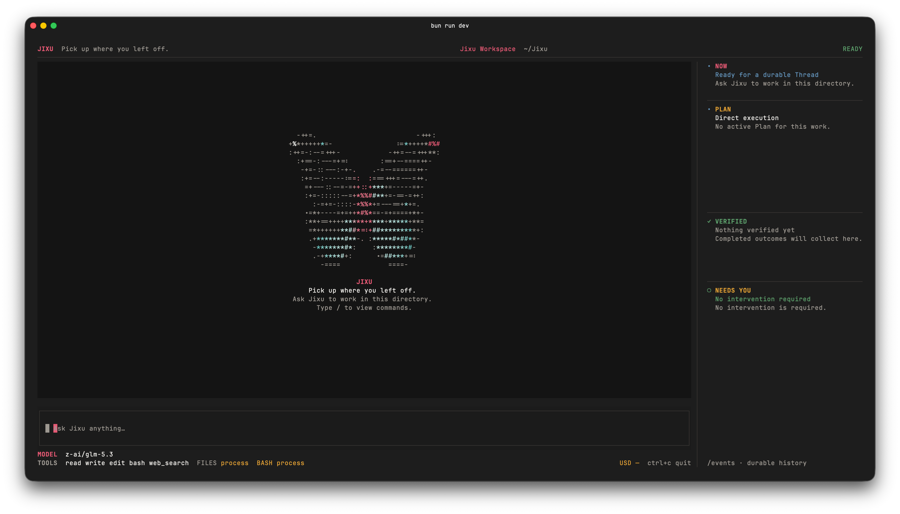

# Jixu

Jixu is a durable single-Agent Harness for TypeScript. Define one Agent, give
it Tools, and continue its work in a durable Thread.

> Jixu is pre-release. The repository is public, but the packages are not
> published yet. The public API may change before 1.0.



## Install

Until the packages are published, run Jixu from source with Node.js 22.19 or
later, pnpm, and Bun 1.4.0:

```bash
pnpm install
pnpm dev
```

The first package release will support global installation with npm, pnpm, or
Bun:

```bash
npm install -g jixu
# pnpm add -g jixu
# bun add -g jixu
```

Then `jixu` will start the TUI from any terminal:

```bash
jixu
```

Ephemeral execution will also be supported:

```bash
npx jixu
# pnpm dlx jixu
# yarn dlx jixu
# bunx jixu
```

The initial native TUI targets are macOS arm64, macOS x64, and Linux x64
with glibc. Bun is not required at runtime.

After publication, install the Agent Framework packages separately when
building an application:

```bash
npm install @jixu/core @jixu/llm @jixu/store-sqlite
```

## Quick start

```ts
import { createHarness, defineAgent } from "@jixu/core";
import { createLLMModelDriver } from "@jixu/llm";
import { SqliteEventStore } from "@jixu/store-sqlite";

const agent = defineAgent({
  instructions: "Be precise and verify your work.",
  model: { provider: "model", model: "your-model" },
  tools: [],
});

const harness = createHarness({
  agent,
  modelDrivers: {
    model: createLLMModelDriver({
      api: "openai-chat-completions",
      apiKey: process.env.MODEL_API_KEY,
      baseURL: "https://api.example.com/v1",
    }),
  },
  store: new SqliteEventStore("./jixu.db"),
});

const thread = await harness.createThread();
const state = await thread.send("Review this design and identify its main risk.");

console.log(state.result);
```

The ordered Event log is the source of truth. State is derived from Events, and
external work follows one path:

```text
Event -> Reducer -> Effect -> Driver -> Event
```

See [SPEC.md](./SPEC.md) for the full product contract and
[CONTRIBUTING.md](./CONTRIBUTING.md) for development guidance.

## License

MIT

## Core status

- [x] **Durable Threads** — multi-turn Agent work survives process restarts,
  with pause, continue, clear, fork, recovery, and side-effect-free replay.
- [x] **Reliable execution** — every model and Tool action is durably requested
  before dispatch, with typed outcomes, bounded retries, approvals, and
  indeterminate-failure handling.
- [x] **A usable Agent runtime** — adaptive Plans, token and cost accounting,
  OpenAI-compatible Chat Completions, Anthropic Messages, local file and shell
  Tools, Jina Web Search, and ordered Tool permissions.
- [x] **The reference TUI and CLI path** — credential-free startup, local BYOK
  configuration, durable Thread inspection, and a standalone macOS arm64
  release candidate verified through npm, pnpm, Yarn, and Bun consumers.
- [ ] **The public package release** — publish to npm, complete target-native
  macOS x64 and Linux x64 builds, and finish production macOS signing and
  notarization.
- [ ] **Long-context continuity** — add adaptive compaction and immutable,
  source-linked continuity snapshots for the same Agent.
- [ ] **First-class Skills and MCP Tools** — extend the same Agent through the
  existing Tool, Effect, and durable Thread model, without Agent routing or
  orchestration.
